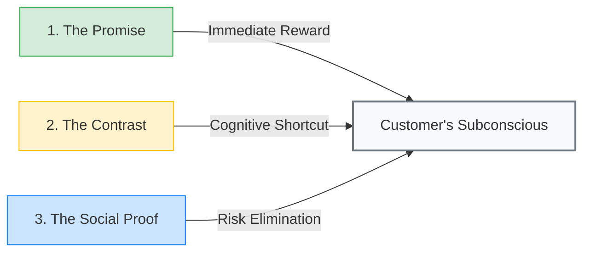
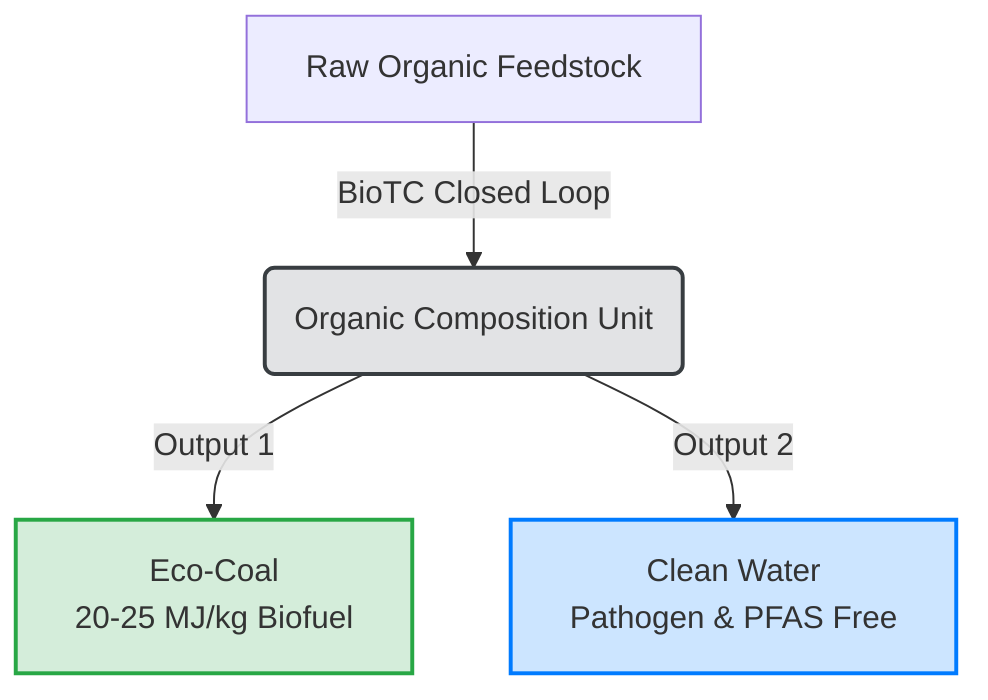

# 📘 BioTC Communication & Pitching Guide
> **Bridging Neuromarketing, Behavioral Economics, and the Clean-Tech Alchemy**

Welcome to the official communication playbook for **BTC Consulting (BioTC)**. This document outlines how to reframe a dirty, complex, and regulation-heavy topic (sewage sludge and waste management) into an inspiring, high-status, and profitable clean-tech narrative.

---

## 🧠 The Neuromarketing Framework

The primitive brain (*amygdala*) runs on survival instincts, visual contrast, and immediate rewards. To bypass bureaucratic inertia and fear of change, our communication is built on three neurological pillars:



---

## 1. The Core Vocabulary Shift 🔄
*We do not use words that trigger disgust or fear. We use words that trigger value and precision.*

| Avoid (Triggers Disgust/Risk) | Use Instead (Triggers Value/Safety) | Psychological Reason |
| :--- | :--- | :--- |
| ❌ Sewage Sludge / Waste | **🟢 Organic Feedstock / Raw Material** | Shifts perception from "dirty trash" to "valuable industrial input." |
| ❌ Hydrochar / Residue | **🟢 Eco-Coal** | Familiar, clean, and high-energy. Bridges sustainability with utility. |
| ❌ HTC Reactor / Boiler | **🟢 Organic Composition Unit** | Sounds like precision molecular materials science, not a sewage tank. |
| ❌ Waste disposal / Drying | **🟢 Molecular Rearrangement / Resource Recovery** | Frames the process as an advanced technological creation. |
| ❌ Sludge lagoons / Mud fields | **🟢 Groundwater Threat (Obsolete dumpsites)** | Highlights active risk and triggers regret aversion (doing nothing is dangerous). |

---

## 2. The Neuromarketing Pillars in Action ⚔️

### I. The Promise (The Brain's Reward)
> [!IMPORTANT]
> **The Core Promise:** Zero Sludge. Net-Positive Energy. Total Environmental Safety.
> 
> *“We don’t burn or bury waste. We compose new resources. Our process turns your sewage liability into high-energy **Eco-Coal**, and the only waste product we return to the community is **clean water**.”*



### II. The Contrast (The Decision-Making Engine)
The brain cannot make decisions without clear comparison. We must contrast the pain of the status quo with the relief of our solution.

```mermaid
graph TD
    subgraph The Obsolete Way (Continuous Loss)
        A1[Raw Wet Sludge] -->|Expensive Hauling| B1(Landfills / Open Mud Fields)
        B1 -->|Leachate| C1[Groundwater Pollution]
        B1 -->|Rotting Organics| D1[Toxic Odor & Public Anger]
        E1[Fossil Fuels] -->|High Heating Bills| F1[WWTP Operating Costs]
    end
    subgraph The BioTC Way (Energy Independence)
        A2[Organic Feedstock] -->|Sealed 2-Hour Loop| B2(Organic Composition Unit)
        B2 -->|5x Volume Reduction| C2[Dry Eco-Coal]
        B2 -->|99% Purification| D2[Recycled Clean Water]
        C2 -->|Free On-Site Combustion| E2[Zero Energy Bills]
    end
    style B1 fill:#f8d7da,stroke:#f5c6cb,stroke-width:2px;
    style C1 fill:#f8d7da,stroke:#f5c6cb,stroke-width:2px;
    style D1 fill:#f8d7da,stroke:#f5c6cb,stroke-width:2px;
    style B2 fill:#d4edda,stroke:#c3e6cb,stroke-width:2px;
    style C2 fill:#d1ecf1,stroke:#bee5eb,stroke-width:2px;
    style D2 fill:#d1ecf1,stroke:#bee5eb,stroke-width:2px;
    style E2 fill:#d4edda,stroke:#c3e6cb,stroke-width:2px;
```

### III. The Social Proof (The Safety Trigger)
> [!TIP]
> Mayors and industrial managers are risk-averse. They do not want to be the "first to try." Use these three trust pillars:
> 1. **Municipal Reference:** MPWiK Lubin (Poland) approved and purchased the copyrights of BioTheCon's TH-AD-HTC technology in October 2025 for full-scale modernization.
> 2. **Scientific Backing:** Developed with thermal and environmental engineering professors at **AGH University of Krakow**, supported by national research grants.
> 3. **Industrial Scale:** Built and delivered "turnkey" by **INTROL Group**, a major engineering and construction holding listed on the stock exchange.

---

## 3. Audience Playbooks 🎯

### B2G: Mayors & Municipal Leaders
*   **Behavioral Trigger:** Regret Aversion (Fear of missing credit or looking obsolete) & Legacy.
*   **The Pitch:**
    > *"Mr. Mayor, every day the municipal sludge sits on open fields, it slowly leaks into the groundwater of your voters. With the new EU directives, environmental penalties are set to skyrocket. You have a narrow window of opportunity. You can act now with 70% grant funding and declare to your voters: **'We stopped poisoning our water. We did it first, and we did it right.'** Or, you can wait, lose the grants, and let your successor take the credit for solving the city's biggest crisis."*

### B2B: Industrial Plant Directors (Pulp & Paper, Food, Chem)
*   **Behavioral Trigger:** Cost Reduction, Energy Security, ESG Metrics.
*   **The Pitch:**
    > *"Why are you paying logistics firms to transport wet water to landfills when it contains the energy equivalent of coal? BioTC converts your factory’s organic waste directly into **Eco-Coal** on-site. You stop paying waste disposal fees, gain a free fuel source for your steam boilers, and slash your carbon footprint (ESG metrics) overnight. It's not a waste plant; it's a clean energy mine on your property."*

### B2B/B2G: The "Good Quality WWTP" Objection
*   **Behavioral Trigger:** Reframing the Unfinished Puzzle.
*   **The Objection:** *“But our current wastewater treatment plant is high-quality and modern!”*
*   **The Pitch:**
    > *"Your wastewater plant is excellent at cleaning water—and you should be proud of it. But it doesn't solve the sludge problem; it actually creates it. The better your plant cleans the water, the more toxic mud you pile on your land. It’s like buying a luxury kitchen but never taking out the trash. BioTC doesn't replace your system; it completes it. We turn the mud your plant collected into **Eco-Coal** and clean water."*

---

> [!NOTE]
> **Action Call:** 
> When pitching, always offer the **Free Waste Audit**. 
> *“Send us a sample of your organic feedstock. Our lab in Poland will process it and show you the exact Eco-Coal yield and financial payback period for your facility.”*
