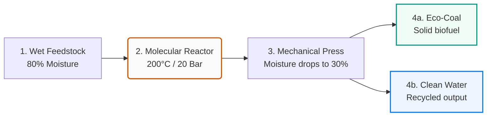

# 📄 BioTC Executive Brief: Turn Sludge Liability into Clean Energy

> **Patented Sewage Sludge & Organic Waste Carbonization (HTC) for Municipalities and Industry**

---

## 🌐 1. Executive Summary

**BioTC** (developed by BioTheCon and represented by **BTC Consulting Sp. z o.o.**) is an integrated clean-tech solution that solves the final, most critical bottleneck of wastewater treatment: **sewage sludge and organic waste accumulation**. 

By combining **Thermal Hydrolysis (TH)** and **Hydrothermal Carbonization (HTC)** in a single, closed-loop system, BioTC converts wet, hazardous organic sludge into sterile, high-energy **Eco-Coal** and **clean, pathogen-free water**.

```
[Wet Organic Waste] ──> [BioTC Closed-Loop System] ──> [Eco-Coal (20-25 MJ/kg)] + [Clean Water]
 (80% moisture, pathogens)    (2-Hour Thermal Cycle)         (Zero Odor, Sterile)     (PFAS & Microplastic Free)
```

---

## ⚡ 2. The Clean-Water Paradox & Regulatory Pressure

Wastewater treatment plants (WWTPs) excel at returning clean water to rivers. However, this process filters out a toxic, wet, pathogen-ridden residue: **sewage sludge**. 

### The Challenges:
*   **The Cost of Wet Logistics:** Sludge typically consists of **80% water**. Traditional hauling and disposal are expensive because operators are essentially paying to transport water.
*   **Regulatory Bans:** Under new EU environmental directives (including **Directive 2024/3019**), landfilling wet sludge is being banned, and direct agricultural spreading is increasingly restricted due to soil contamination risks.
*   **Persistent Threats (PFAS & Microplastics):** Traditional composting and low-temperature drying fail to eliminate "forever chemicals" (PFAS), microplastics, and pharmaceutical residues. These toxins accumulate in agricultural soil and leak back into groundwater.
*   **Doing Nothing is the Highest Risk:** Landfill taxes and carbon emission penalties are rising exponentially, making old disposal methods financially unsustainable.

---

## 🧪 3. The Technology: Integrated TH + HTC

Instead of burning or composting, BioTC uses a pressurized thermochemical process that mimics the natural formation of coal over millions of years, compressing it into **2 hours**.



1.  **Thermal Destruction:** The organic feedstock is cooked at **180–220 °C** under autogenous pressure (**15–25 bar**). At this level, cellular walls rupture, destroying 100% of pathogens, bacteria, microplastics, and PFAS.
2.  **Physical Transformation:** The sludge loses its colloidal structure. Water, which was chemically bound inside the sludge cells, is released and can be easily pressed out mechanically.
3.  **Net-Positive Energy Profile:** BioTC recycles the heat generated during the reaction to pre-heat incoming feedstock. When integrated with anaerobic digestion (biogas tanks), the liquid run-off stimulates additional **biogas yields by up to 60%**.

---

## 💎 4. Value-Added Outputs

The BioTC process converts a toxic municipal liability into two valuable commodities:

### I. Eco-Coal (Hydrochar)
A dry, sterile, and odorless solid carbon fuel:
*   **Energy Content:** **20–25 MJ/kg** (equivalent to high-grade sub-bituminous coal or wood pellets).
*   **Physical Form:** Easy to store, transport, and pulverize.
*   **Applications:** Industrial boiler fuel (co-combustion), raw material for cement factories, soil amendment (biochar), or brick additive.
*   **CO2 Neutral:** Registered as a sustainable biofuel, helping enterprises lower their carbon footprint (ESG ratings).

### II. Clean Recycled Water
*   **Safety Profile:** Completely sterile, free from PFAS, microplastics, and active chemical contaminants.
*   **Destination:** Safely returned to the WWTP inlet without loading the biological stage, reducing overall operating strain.

---

## 📊 5. Financial & Investment Case (ROI)

Implementing BioTC transitions sewage management from an **annual budget expense** to a **profitable revenue stream**.

| Metric | Traditional Landfilling & Hauling | BioTC Integrated TH+HTC |
| :--- | :---: | :---: |
| **Sludge Volume Reduction** | 0% | **Up to 80% (5x reduction)** |
| **PFAS & Microplastic Elimination** | ❌ No | **✅ 100% Destroyed** |
| **Yearly Operating Cost** | 🔴 High and growing (hauling fees + taxes) | **🟢 Net-Positive (fuel production + energy recovery)** |
| **Biogas Yield Increase** | 0% | **+60% (reclaims digester capacity)** |
| **Estimated Project ROI** | 💸 Infinite Cost (no return) | **📈 4–6 Years Payback Period** |

### Green Financing Eligibility:
Because BioTC satisfies strict circular economy criteria, projects qualify for environmental subsidies and green grants covering **up to 70% of capital expenditure**.

---

## 🏛️ 6. Proven Credentials & Partners

You are not buying unproven prototype technology. BioTC is backed by leading European institutions:

*   **The Lubin Landmark Case:** In October 2025, the municipal water utility **MPWiK Lubin (Poland)** officially approved and purchased the copyrights to implement the integrated TH-AD-HTC concept for their city-wide modernization.
*   **Scientific Foundation:** Developed in partnership with environmental and thermal engineering faculties at the **AGH University of Krakow**, supported by national research and development grants.
*   **Industrial General Contractor:** All systems are built, installed, and commissioned "turnkey" by **INTROL Group**, a leading European engineering holding listed on the Warsaw Stock Exchange.

---

## 📞 7. Call to Action: Request a Free Waste Audit

Before initiating any project, we verify the exact business case using your specific material. We offer a **Free Organic Feedstock Audit**:

1.  **Sample Collection:** Send a 2 kg sample of your municipal or industrial organic waste to our laboratory.
2.  **Lab Simulation:** Our facility in Poland will process the sample in an HTC test reactor.
3.  **Feasibility Report:** We will provide you with a detailed lab report containing:
    *   The exact **Eco-Coal yield** and its calorific value (MJ/kg).
    *   The physical and chemical composition of the output.
    *   A tailored **financial payback simulation (ROI)** for your facility.

### Contact Information:
*   **Company:** BTC Consulting Sp. z o.o. (Official BioTC Representative)
*   **Office Address:** ul. Daszyńskiego 34/3, 44-100 Gliwice, Poland
*   **E-mail:** andrzej.krop@biotc.pl
*   **Phone:** +48 608 003 458
