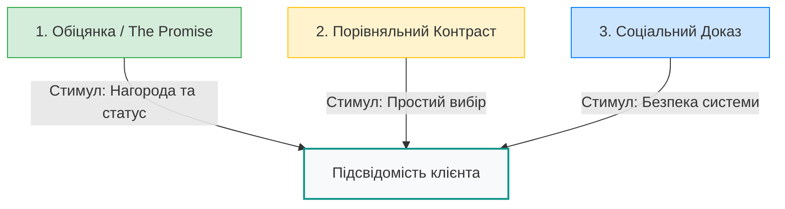
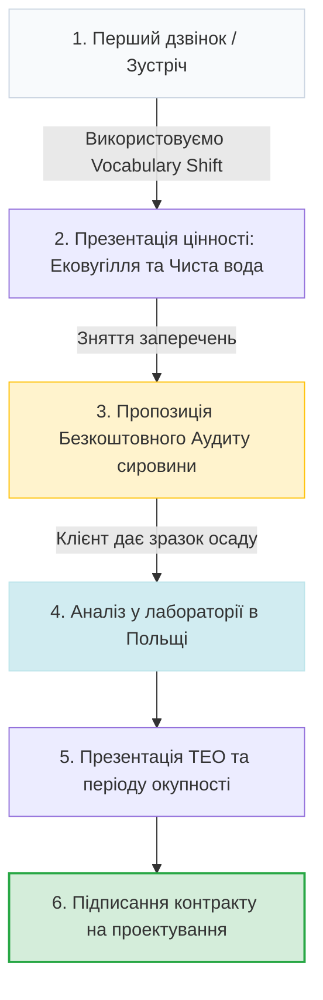

# 📘 Посібник з комунікації для персоналу BioTC: Нейромаркетинг та мовні стандарти

> **Як перетворити екологічну проблему на високостатусне технологічне рішення та закрити угоду**

Цей посібник є офіційним стандартом комунікації для команди **BTC Consulting (BioTC)**. Він пояснює, як правильно говорити з клієнтами (муніципалітетами та бізнесом), які терміни використовувати, а яких категорично уникати, і — найголовніше — **чому** саме така побудова мови веде до успішного партнерства.

---

## 🧠 Частина 1. Чому мова має значення: Нейробіологія рішень

У сфері очищення стічних вод та промислових відходів більшість переговорів провалюється через неправильний вибір слів. Коли ми використовуємо слова на кшталт *«каналізаційні осади»*, *«токсичний мул»* або *«утилізація відходів»*, ми несвідомо запускаємо в мозку клієнта захисні механізми.

### 1. Бар'єр найдавнішого мозку (Амигдала)
Найдавніша частина нашого мозку (рептильний мозок та амигдала) відповідає за виживання. Вона працює на рівні швидких асоціацій:
*   **Огида:** Слова *«мул»*, *«шлам»*, *«лайно»* асоціюються з інфекціями та біологічною загрозою. Мозок прагне фізично й ментально відсторонитися від цього.
*   **Страх перевірок та штрафів:** Слово *«відходи»* асоціюється з екологічними інспекціями, ліцензіями, штрафами та судовими позовами.
*   **Пасивність:** Якщо тема викликає стрес, чиновник чи директор намагається відкласти рішення (*«ми подумаємо про це наступного року»*).

### 2. Три стовпи нейромаркетингу BioTC
Щоб обійти цей захисний бар'єр, ми перекодовуємо інформацію. Наша комунікація базується на трьох принципах, які викликають довіру та бажання діяти:

1.  **Обіцянка (The Promise) — швидка нагорода:** Ми не просто позбавляємо клієнта сміття. Ми створюємо цінність. Наша обіцянка: *«Ми перетворюємо екологічний пасив на енергетичний актив. Єдиний побічний продукт нашої системи — чиста вода»*.
2.  **Контраст (The Contrast) — когнітивне полегшення:** Мозок не вміє приймати рішення у вакуумі. Йому потрібне порівняння. Ми показуємо різницю: *«Зараз ви платите за вивезення води на сміттєзвалища $\rightarrow$ З BioTC ви отримуєте безкоштовне паливо на місці»*.
3.  **Соціальний доказ (The Social Proof) — безпека:** Клієнт боїться бути першопрохідцем, на якому технологія зламається. Ми одразу знімаємо цей страх референсом Любіна, авторитетом AGH та надійністю INTROL.

---

## 🔄 Частина 2. Матриця переформатування мови (Vocabulary Shift)

Ми свідомо замінюємо «брудні» та «ризиковані» слова на терміни з екологічного та матеріалознавчого лексикону. Це піднімає статус нашого продукту в очах клієнта.

| ❌ Що НЕ можна говорити | 🟢 Як говорити замість цього | 🧠 Психологічне обґрунтування (Чому це працює) |
| :--- | :--- | :--- |
| **Мул, шлам, каналізаційні осади, відходи** | **Органічна сировина, вихідна речовина, біомаса** | Змінює сприйняття з «бруду, який треба викинути» на «цінний ресурс, який можна переробити на паливо». |
| **Реактор HTC, котел, автоклав** | **Установка органічного компонування, система молекулярного рекомбінування** | Звучить як високотехнологічне обладнання з лабораторії матеріалознавства, а не як небезпечний бак під тиском. |
| **Гідровугілля, осад реактора, вугільний пил** | **Ековугілля (Eco-Coal), відновлюване біопаливо** | Термін «гідровугілля» незрозумілий клієнтам. «Ековугілля» звучить екологічно, чисто, знайомо і з чітким акцентом на енергетичну цінність. |
| **Утилізація, спалювання мулу, висушування** | **Термічне відновлення ресурсів, закритий молекулярний цикл** | «Спалювання» та «сушіння» асоціюються з викидами в повітря, димом та протестами екологів. «Відновлення ресурсів» — це чистий круговий процес. |
| **Мулові поля, лагуни, звалища мулу** | **Застарілі накопичувачі, джерела загрози ґрунтовим водам** | Підкреслює, що накопичення мулу — це не просто склад, а активна екологічна бомба під ногами виборців чи заводу. |
| **Продаж обладнання, покупка технології** | **Інтеграція рішення, технологічне партнерство** | Знижує відчуття комерційного тиску. Ми не «впарюємо залізо», ми вирішуємо критичну проблему клієнта разом із ним. |

---

## 🎯 Частина 3. Сценарії розмови та психологічні тригери (Audience Playbooks)

Клієнти діляться на дві групи, і говорити з ними потрібно абсолютно різними мовами.

### 🏛️ 1. Муніципальний сектор: Мери міст, Голови ОТГ, Керівники Водоканалів (B2G)
*   **Психологічний тригер:** **Неприйняття втрат (Loss Aversion)** — страх втратити репутацію, отримати штрафи або пропустити можливість отримати гранти.
*   **Цінність для них:** Безпека виборців, чиста вода, зелений імідж, політична спадщина.

#### ⛔️ Неправильно:
> *«Ми продаємо реактори HTC для утилізації мулу. Ваші очисні споруди переповнені, і ми можемо висушити ваш осад, щоб ви менше платили за звалища. Це коштує 3 мільйони євро».*
*(Реакція: «Грошей немає, екологи будуть проти спалювання, зачекаємо наступних виборів»).*

#### 🟢 Правильно (за методом Нейромаркетингу):
> «Пане Голово, очисні споруди вашого міста роблять чудову роботу — вони повертають чисту воду в річку. Але куди дівається весь бруд? Він накопичується на околицях міста у вигляді тисяч тонн вологого осаду. 
> 
> Цей мул — як губка, що містить мікропластик та небезпечні сполуки PFAS, які не розкладаються сотні років і поступово просочуються у підземні води, звідки п'ють воду ваші мешканці. З новими екологічними директивами штрафи за збереження такого мулу зростуть у рази, а звалища його більше не приймуть.
> 
> Ми пропонуємо **інтегрувати систему органічного компонування BioTC**. Вона закриває цей цикл: перетворює всю накопичену речовину на сухе стерильне **ековугілля** та абсолютно чисту воду. 
> 
> Зараз діють програми європейського фінансування, які покривають **до 70% вартості проекту**. Ви можете діяти зараз, залучити кошти й увійти в історію як лідер, який назавжди вирішив проблему чистих підземних вод міста. Або можна зачекати, втратити гранти й перекласти ці витрати прямо на тарифи для населення».

---

### 🏭 2. Промисловий сектор: Технічні директори, Екологи заводів, Фінансові директори (B2B)
*   **Психологічний тригер:** **Економічна вигода (ROI) та Енергетична безпека**.
*   **Цінність для них:** Зниження операційних витрат (OPEX), отримання дешевої енергії, покращення показників ESG (сталий розвиток для акціонерів).

#### ⛔️ Неправильно:
> *«Наша установка HTC сушить осад з вологістю 80% під високим тиском. Ви зможете спалювати його в топках. Це зменшить об'єм ваших відходів».*
*(Реакція: «У нас немає вільної пари, сушіння потребує багато газу, це невигідно»).*

#### 🟢 Правильно:
> «Чому ваше підприємство щомісяця платить тисячі євро перевізникам за вивезення відходів очисних споруд на полігони? Ви буквально платите за транспортування води, адже вологість цього осаду — 80%. 
> 
> Ми пропонуємо перетворити цю статтю витрат на власне джерело енергії. Технологія BioTC переробляє вашу органічну сировину безпосередньо на території заводу. На виході ви отримуєте **ековугілля** з теплотворністю 20–25 МДж/кг, яке можна безкоштовно спалювати у ваших технологічних котлах для отримання пари.
> 
> Ви ліквідуєте витрати на логістику відходів, зменшуєте закупівлю газу чи вугілля та автоматично покращуєте ESG-показники підприємства для міжнародних партнерів. Проект повністю окупає себе за **4–6 років**, після чого приносить чистий прибуток».

---

## 🛠️ Частина 4. Робота з технічними запереченнями (FAQ)

Коли клієнт починає цікавитися деталями, у нього виникають раціональні сумніви. Персонал повинен відповідати чітко, переводячи розмову в русло безпеки та доведеної практики.

### Заперечення 1: «У нас дуже сучасні очисні споруди, нам це не потрібно»
*   **Метод нейтралізації: Рефреймінг незавершеного пазла (The Unfinished Puzzle).**
*   **Формула відповіді:**
    > «Ви абсолютно праві, ваші очисні споруди — одні з найкращих у регіоні. Але вони роблять лише половину роботи — вони очищують воду. Проте вони не знищують забруднення, а лише концентрують його в осад. Чим краще працюють ваші фільтри, тим більше небезпечного мулу накопичується на вашій території. 
    > 
    > Це як побудувати ідеальну кухню, але ніколи не виносити сміття. Технологія BioTC не конкурує з вашими очисними спорудами. Вона їх **завершує**, закриваючи цикл утилізації кінцевих відходів».

### Заперечення 2: «А якщо ваша технологія занадто нова й нестабільна?»
*   **Метод нейтралізації: Соціальний доказ (Social Proof).**
*   **Формула відповіді:**
    > «Ми розуміємо ваші побоювання, тому не пропонуємо вам бути експериментальним майданчиком. Наша технологія повністю сертифікована в ЄС та має потужні референси:
    > 1.  **Муніципальне впровадження:** У жовтні 2025 року міський водоканал **MPWiK Lubin (Польща)** затвердив і придбав авторські права на впровадження цієї технології для модернізації міста.
    > 2.  **Наукова база:** Процеси розроблені спільно з професорами **AGH Гірничо-металургійної академії в Кракові** в межах державних дослідницьких грантів.
    > 3.  **Індустріальний масштаб:** Проектування та будівництво установок "під ключ" здійснює інженерний гігант **INTROL Group** — великий польський холдинг, акції якого торгуються на фондовій біржі».

### Заперечення 3: «Ваш реактор працює під тиском 20 бар. Чи безпечно це?»
*   **Формула відповіді:**
    > «Процес BioTC повністю автоматизований та герметичний. Установка розрахована з коефіцієнтом міцності, що втричі перевищує робочий тиск. На відміну від класичних сушарок мулу, де є ризик утворення пилу та вибуху сухої органіки при контакті з повітрям, наш процес відбувається в **рідкому середовищі без доступу кисню**. Це робить його технологічно безпечнішим за стандартні парові котли, які працюють на кожному промисловому підприємстві».

### Заперечення 4: «Чи не буде неприємного запаху навколо установки?»
*   **Формула відповіді:**
    > «Ні, це повністю виключено. По-перше, система є абсолютно герметичним контуром. По-друге, під дією температури 200°C і тиску відбувається руйнування органічних сполук сірки та азоту, які є джерелом смороду. Отримане ековугілля є абсолютно стерильним і має легкий природний запах дерева чи торфу».

---

## 📋 Частина 5. Алгоритм першого контакту (Checklist для команди)

Коли ви вперше спілкуєтеся з потенційним клієнтом, ваша мета — **не продати установку відразу, а отримати зразок сировини для аудиту**. Це безкоштовний крок, який ні до чого не зобов'язує клієнта, але залучає його у процес.

### Кроки першої зустрічі:
1.  **Дізнайтеся об'єми:** Запитайте, скільки тонн вологої речовини утворюється на підприємстві/очисних спорудах за добу та яка її вологість.
2.  **Зафіксуйте витрати:** Дізнайтеся, скільки грошей вони витрачають зараз на вивезення та захоронення мулу за рік.
3.  **Зробіть пропозицію, від якої неможливо відмовитися:**
    > *«Давайте ми проведемо для вас **Безкоштовний екологічний аудит сировини**. Ви передаєте нам невеликий зразок вашого осаду (1-2 кг). Наша сертифікована лабораторія в Польщі проведе його тестування на установці HTC. 
    > 
    > Ми надамо вам детальний звіт: який точний вихід ековугілля ви отримаєте, яка його калорійність та розрахуємо точний фінансовий період окупності інвестицій для вашого підприємства. Ви побачите реальні цифри перед тим, як приймати будь-які рішення»*.
4.  **Надішліть буклет:** Надішліть офіційний буклет BioTC (де описані референси та технологія).

---

> [!IMPORTANT]
> **Головне правило BioTC:** 
> Ми ніколи не захищаємося. Ми рефреймимо проблему. Будь-яке заперечення клієнта — це привід показати цінність нашої технології через безпеку, екологію та чистий прибуток.
