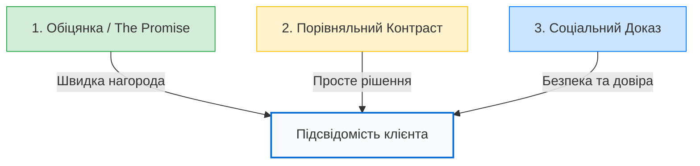

# 📘 Практичний посібник з комунікації для персоналу BioTC
> **Трансформація екологічних викликів у високостатусні інженерні рішення**

Цей посібник створений для команди **BTC Consulting (BioTC)**. Його мета — навчити персонал правильно трансформувати складну, регуляторну та часом "неприємну" тему (осади стічних вод і відходи) в авторитетний, екологічно безпечний та фінансово привабливий інженерний наратив.

---

## 🧠 Частина 1. Психологічна основа: Нейромаркетинг у B2B та B2G

Людський мозок (особливо його найдавніша частина — *амигдала*) прагне уникати ризиків, бруду та зайвих витрат енергії. Якщо ви почнете розмову зі слів "осади стічних вод", "токсичний мул" або "утилізація відходів", мозок вашого співрозмовника миттєво зреагує захисним бар'єром (огида, страх перевірок, бажання відкласти рішення).

Тому наша комунікація базується на трьох стовпах нейромаркетингу:

1.  **Обіцянка (The Promise):** Миттєва нагорода. Ми не спалюємо і не закопуємо відходи. Ми рекомбінуємо молекули, перетворюючи сировину на енергію. Єдиний побічний продукт нашої системи — чиста вода.
2.  **Контраст (The Contrast):** Мозок приймає рішення лише на основі порівняння. Ми показуємо чіткий контраст між застарілим, дорогим вивезенням накопиченого мулу та сучасною енергетичною незалежністю.
3.  **Соціальний доказ (The Social Proof):** Зняття страху "бути першим". Ми демонструємо діючі референси, авторитетну академічну підтримку та надійного інженерного партнера.

---

## 🔄 Частина 2. Матриця переформатування мови (Vocabulary Shift)

*Ми не використовуємо слова, які асоціюються із ризиком чи брудом. Ми використовуємо терміни, що підкреслюють цінність та точність.*

| ❌ Уникати (викликає страх/огиду) | 🟢 Використовувати (цінність/безпека) | 🧠 Психологічне обґрунтування |
| :--- | :--- | :--- |
| **Мулові осади, мул, відходи** | Органічна сировина, вихідна речовина | Перетворює "брудне сміття" на цінний промисловий ресурс. |
| **Гідровугілля, осад реактора** | Ековугілля (Eco-Coal) | Зрозуміле, чисте та високоенергетичне паливо. Асоціюється із теплом. |
| **Реактор HTC, котел** | Установка органічного компонування | Звучить як точне молекулярне обладнання, а не як брудний бак. |
| **Утилізація, сушіння мулу** | Молекулярне рекомбінування, відновлення ресурсів | Демонструє високий технологічний рівень та турботу про екологію. |
| **Мулові майданчики, лагуни** | Загроза ґрунтовим водам (застарілі накопичувачі) | Підкреслює активний ризик недіяння, стимулює бажання вирішити проблему. |

---

## 🎯 Частина 3. Сценарії комунікації за сегментами (Audience Playbooks)

### 🏛️ Сегмент 1: Мери міст та керівники громад (B2G)
*   **Головний тригер:** Страх втрати репутації (Regret Aversion), прагнення залишити позитивний слід в історії громади, отримання грантів.
*   **Ключовий посил:** Захист води для виборців та залучення європейського фінансування.

> **Скрипт розмови / Презентація:**
> «Пане Голово, кожен день, поки мул лежить на відкритих полях за містом, він повільно отруює підземні водоносні горизонти, звідки п'ють воду ваші мешканці. З новими директивами ЄС екологічні штрафи зростуть у кілька разів. 
> Зараз у вас є унікальне вікно можливостей: залучити грантове фінансування (до 70%), модернізувати очисні споруди та заявити громаді: *“Ми повністю очистили нашу воду і землю. Ми зробили це першими в регіоні й зробили це правильно”*. Або ж можна зачекати, втратити гранти, платити мільйонні штрафи та залишити цю екологічну катастрофу наступникам».

---

### 🏭 Сегмент 2: Директори промислових підприємств (B2B)
*(Целюлозно-паперові, харчові, хімічні заводи, птахофабрики)*
*   **Головний тригер:** Зниження операційних витрат (OPEX), енергетична безпека, виконання вимог ESG.
*   **Ключовий посил:** Перетворення логістичних витрат на безкоштовне паливо.

> **Скрипт розмови / Презентація:**
> «Чому ви щомісяця сплачуєте логістичним компаніям тисячі євро за те, щоб вони вивозили вашу сировину з вологістю 80% на полігони? Ви буквально платите за перевезення води. 
> Установка BioTC перетворює цю сировину на висококалорійне **ековугілля** безпосередньо на території вашого заводу. Ви повністю ліквідуєте статтю витрат на вивезення відходів, отримуєте безкоштовне паливо для своїх технологічних котлів та автоматично покращуєте екологічні показники ESG компанії. Це не система переробки відходів — це власне енергетичне джерело на вашому підприємстві».

---

### 🛠️ Сегмент 3: Робота із запереченням «У нас чудові сучасні очисні споруди»
*   **Суть заперечення:** Клієнт вважає, що оскільки його очисні споруди очищають воду добре, їм більше нічого не потрібно.
*   **Метод нейтралізації:** Рефреймінг незавершеного пазла.

> **Скрипт розмови / Презентація:**
> «Ваші очисні споруди дійсно одні з найкращих, і ви виконали величезну роботу, очищаючи воду для річки. Але очисні споруди не знищують забруднення — вони лише збирають його в одному місці. Чим краще працюють ваші фільтри, тим більше токсичного, вологого мулу накопичується на вашій землі. Це як побудувати розкішну сучасну кухню, але ніколи не виносити сміття. 
> Технологія BioTC не замінює ваші очисні споруди — вона їх завершує. Ми закриваємо цикл: забираємо накопичену вологу речовину, нейтралізуємо мікропластик та PFAS, і повертаємо вашому підприємству сухе енергетичне **ековугілля** та абсолютно чисту воду».

---

## ❓ Частина 4. Нейтралізація технічних заперечень (FAQ для персоналу)

#### 1. «Чим ековугілля краще за спалювання сирого мулу?»
*   **Відповідь:** Спалювання вологого мулу (вологість 80%) потребує колосальної кількості газу чи сторонньої енергії лише на те, щоб випарувати воду. Це енергетичний та фінансовий мінус. BioTC за допомогою автогенного тиску та температури руйнує клітинні оболонки на молекулярному рівні, завдяки чому вода відділяється механічним пресуванням. На виході ми отримуємо сухий продукт із теплотворністю 20-25 МДж/кг (на рівні бурого вугілля) з мінімальними витратами енергії.

#### 2. «Як щодо запаху навколо установки?»
*   **Відповідь:** Процес повністю закритий і герметичний. Більше того, термічна обробка при 200°C повністю розкладає сполуки сірки та азоту, які є джерелом неприємного запаху. Отримане ековугілля має легкий нейтральний запах дерева чи торфу.

#### 3. «Чи безпечна вода, яка залишається після процесу?»
*   **Відповідь:** Вода проходить повну термічну стерилізацію під тиском. Усі патогени, бактерії, мікропластик, гормональні препарати та стійкі сполуки PFAS (на відміну від звичайного сушіння чи компостування) повністю знищуються. Ця вода повертається на очисні споруди абсолютно безпечною для навколишнього середовища.

---

## 📋 Частина 5. Алгоритм дій при контакті з потенційним клієнтом (Checklist)

При першому контакті з представником Водоканалу чи промислового підприємства слідуйте наступним крокам:

1.  **Зафіксуйте базові параметри:** 
    *   Який об'єм вологої сировини утворюється на добу (у тоннах) або яка чисельність населення (RLM)?
    *   Яка поточна вологість осаду після дегідратації?
    *   Скільки компанія витрачає на вивезення/утилізацію за рік?
2.  **Застосуйте правильну термінологію:** Не кажіть "осади стічних вод", говоріть про "органічну сировину для виробництва ековугілля".
3.  **Запропонуйте Безкоштовний Екологічний Аудит:**
    > *«Давайте ми проведемо безкоштовний аудит вашої сировини. Наша лабораторія в Польщі протестує зразок вашого осаду, визначить точний вихід ековугілля та розрахує період окупності інвестицій спеціально для вашого об'єкта»*.
4.  **Надішліть брошуру BioTC:** Завжди відправляйте офіційний буклет BioTC для підтвердження репутації (референс Любін, науковий партнер AGH та підрядник INTROL).
